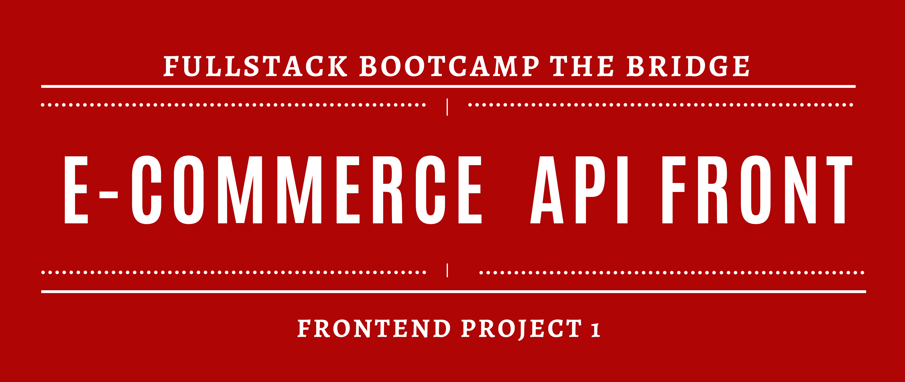
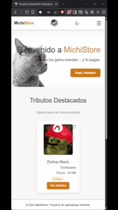

# Introducción
Proyecto grupal del sprint de Frontend en el que se combinan los conocimientos adquiridos en React y SASS. 

## Descripción del proyecto
Hemos desarrollado un frontend con las siguientes funcionalidades:
- Registro y login de usuarios.
- Vista de productos disponibles.
  - Carrito compacto en la propia página de productos.
- Carrito de compra.
- Visionado del perfil de usuario junto con sus pedidos, reviews de productos, productos favoritos, y más.
- Buscador y filtrado de productos.
- Vista admin con panel administrativo:
    - Solo disponible si estás logueado con el usuario admin.
  - Visionado de todos los pedidos.
  - Visionado de (y capacidad de actualizar) todos los usuarios de la página.
  - Pestaña para modificar y añadir productos.
- Añadir productos a favoritos.
- Añadir reviews de productos (y poder añadir imágenes, y editar las reviews).
- Con guards para más seguridad.
- Responsive.
- Toggle de tema claro y oscuro.

## Tecnologías y librerías utilizadas
- Frontend
  - React – Biblioteca principal para construir la interfaz de usuario.

  - React Router DOM – Enrutamiento en aplicaciones SPA.

  - Ant Design (AntD) – Librería de componentes UI.

  - Material UI (MUI) – Componentes de interfaz basados en Material Design.

  - Axios – Cliente HTTP para consumir APIs.

  - Sass – Preprocesador CSS para estilos más organizados y escalables.

- Herramientas de desarrollo
  - Vite – Herramienta rápida para desarrollo y build de aplicaciones frontend.

## Instalación
⚠️ **Atención:**
#### Backend
Este proyecto consume una API desarrollada por [@Ame3310](https://www.github.com/Ame3310).
Tendrás que clonar la versión más reciente, disponible [aquí](https://github.com/ame3310/backendProyectoReact) y seguir los siguientes pasos:
1. Renombrar sequelizerc.txt a .sequelizerc
2. Renombrar env.example.txt a .env y ajustar DB_USER, DB_PASSWORD y DB_NAME.
3. Crear la base de datos `sequelize db:create`
4. Instalar dependencias `npm i`
5. Ejecutar ` node scripts/reset-db.js`
6. Ejecutar `node src/server.js` para levantar el servicio.

#### Frontend
1. Clona este proyecto
2. Instala dependencias `npm i`
3. Levanta el proyecto con `npm run dev`

## Demo del producto

_Más imágenes disponibles dentro de la carpeta `demo`_